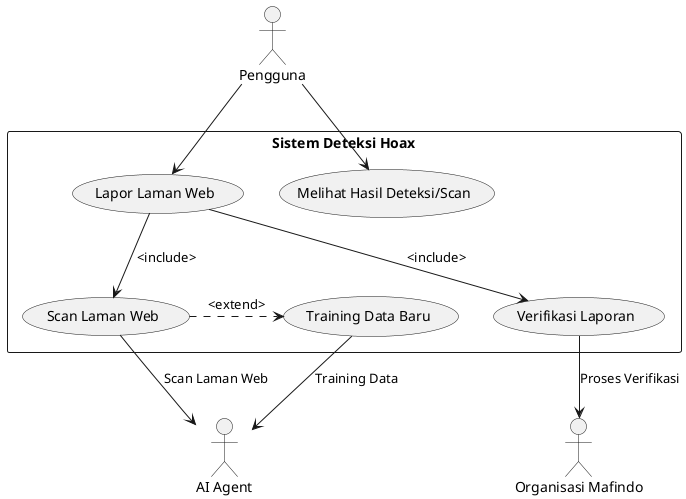

# rpl

```plantuml
@startuml

actor Pengguna
actor "Organisasi Mafindo" as Mafindo
actor "AI Agent" as AIAgent

rectangle "Sistem Deteksi Hoax" {
  usecase "Lapor Laman Web" as UC_Lapor
  usecase "Melihat Hasil Deteksi/Scan" as UC_LihatHasil
  usecase "Scan Laman Web" as UC_ScanWeb
  usecase "Training Data Baru" as UC_Training
  usecase "Verifikasi Laporan" as UC_Verifikasi
}

Pengguna --> UC_Lapor
Pengguna --> UC_LihatHasil
UC_Lapor --> UC_Verifikasi : "<include>"
UC_Verifikasi --> Mafindo : "Proses Verifikasi"
UC_Lapor --> UC_ScanWeb : "<include>"
UC_ScanWeb --> AIAgent : "Scan Laman Web"
UC_ScanWeb .> UC_Training : "<extend>"
UC_Training --> AIAgent : "Training Data"

@enduml
```